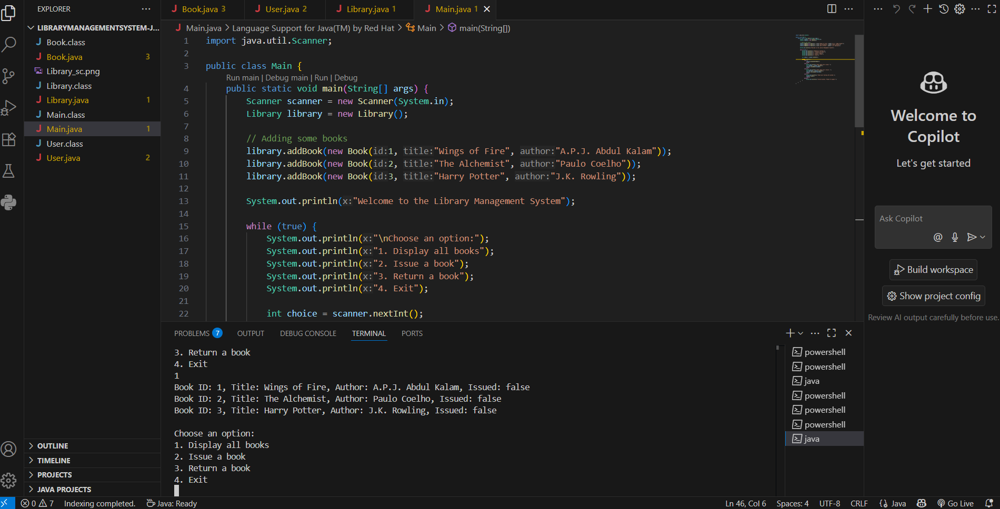

# LibraryOOPConsoleApp

A simple **Library Management System** built using Java and Object-Oriented Programming (OOP) principles. This console-based application allows you to manage books with options to issue and return them.

## 📚 Features
- Add books to the library
- Display all available books
- Issue a book by ID
- Return a book by ID

## 🔧 Technologies Used
- Java
- VS Code
- Terminal

## 🧠 OOP Concepts Demonstrated
- Abstraction
- Encapsulation
- Inheritance
- Polymorphism

## 📦 Java Classes
- `Book`: Holds information about each book
- `User`: (Optional) Represents a user (can be extended)
- `Library`: Manages book collection and actions
- `Main`: Provides the menu and user interaction

## ▶️ How to Run

```bash
javac *.java
java Main
```

## 🖼 Sample Output



---

## 👨‍💻 Author  
**Sudha tanmai**

🔗 GitHub Repository: [JavaLibraryConsoleApp](https://github.com/Sudhatanmai/LibraryOOPConsoleApp)

---

Thank you for checking out my Java Library Management System! 😊  
Feel free to explore the code, try it out, and suggest improvements.

